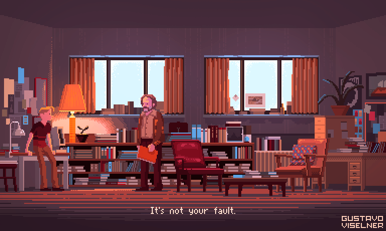

# Gra 2D w stylu indie

## Autorzy
Kamil Bugała (gr 9, @agluszak na githubie)

## Opis

Bardzo chętnie stworzę gierkę w stylu indie. 
Zależałoby mi, aby gra była jak najbardziej zręcznościowa i dynamiczna.

## Funkcjonalność
- Generowanie map
- Dashowanie i jak najwięcej efektów ruchu
- Stworzenie AI przeciwników
- Możliwość zapisywania i wczytywania stanu gry

## Propozycja podziału na części
W pierwszej części zajmę się generowaniem planszy i ogólnym ruchem bohatera.

W drugiej części dodamy do tego losowy generator map, zapisywanie/wczytywanie stanu gry oraz system punktacji.

## Biblioteki
### Amethyst
<a href="https://amethyst.rs/" rel="yolo"><a/>
Zdecydowałem się korzystać z silnika Amethyst, ze względu na super dokumentację.

[Amethyst documentation](https://book.amethyst.rs/book/stable/)
  
